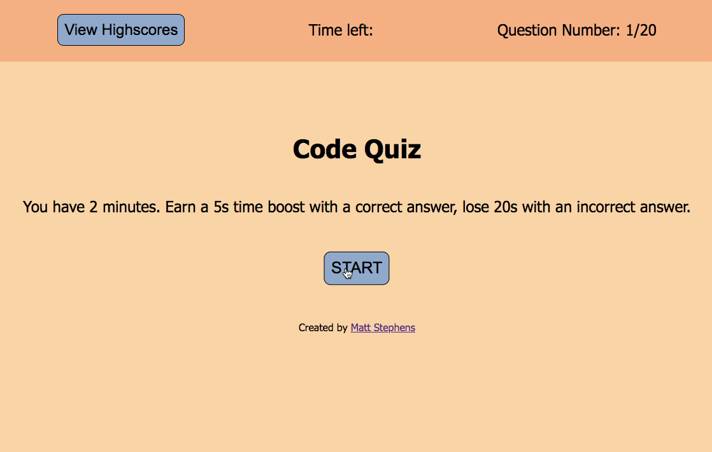

# Code Quiz **([Link](https://mstephen19.github.io/codeQuiz/))**

This is a timed 20 question JavaScript quiz, in which the user is rewarded with time upon correctly answering a question, and is docked time upon incorrectly answering a question. Upon completion, the user can locally save their highscores, along with their name.



## Built With

* [HTML](https://developer.mozilla.org/en-US/docs/Web/HTML)
* [CSS](https://developer.mozilla.org/en-US/docs/Web/CSS)
* [Javascript](https://developer.mozilla.org/en-US/docs/Web/JavaScript)
* [ColorHunt](https://colorhunt.co/palette/fef1e6f9d5a7ffb08590aacb) (for color pallete)
* [Meyer Web reset.css file](https://meyerweb.com/eric/tools/css/reset/)

## Notable Stuff

### Javascript logic used to switch between questions

This project is utilizing an array of objects. Each object is a question.

``` Javascript
function loadQuizItems() {
  document.getElementById("viewHighscores").style.display = "none";
  startScreen.style.display = "none";
  quizBox.style.display = "flex";
  questionElement.textContent = theQuiz[questionIndex].question;
  for (let i = 0; i <= 3; i++) {
    answersElements.children[i].children[0].textContent =
      theQuiz[questionIndex].answers[i];
  }
}
```

## Deployed Link

* [Live Site Here](https://mstephen19.github.io/codeQuiz/)

## Author

**Matt Stephens** 

- [Link to Portfolio Site](https://mstephen19.github.io)
- [Link to Github](https://github.com/mstephen19)
- [Link to LinkedIn](https://www.linkedin.com/mstephen19)

### Acknowledgments

* Shoutout to [Jesse Lewis](https://www.linkedin.com/in/jesseaustinlewis/) for helping me out briefly with localStorage